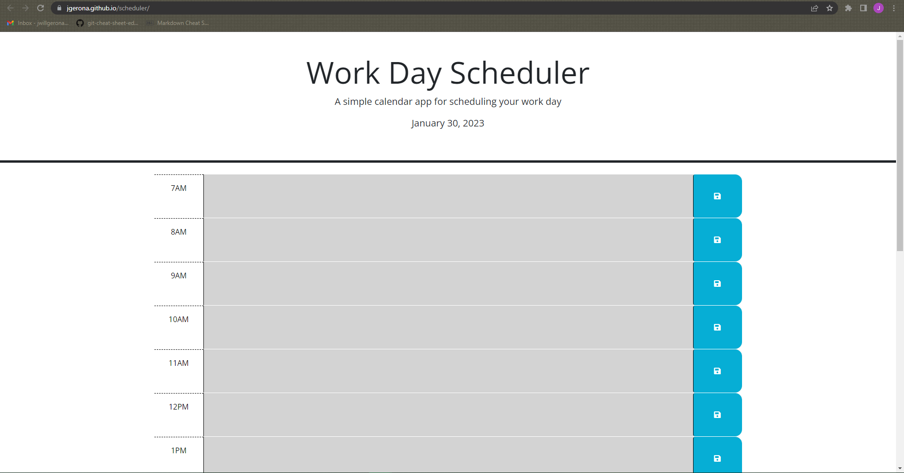

# <scheduler>

## Description

a webpage to contain a schedule for the day. Utilizing HTML, CSS, JavaScript, and Third-party APIs. It is capable of storing a schedule to local storage while visually displaying what events are happened/happening before, during, after the current hour. 

## Assets

The following image is a preview of the web application's appearance.

You can use this [link](https://jgerona.github.io/scheduler/) to access the page.